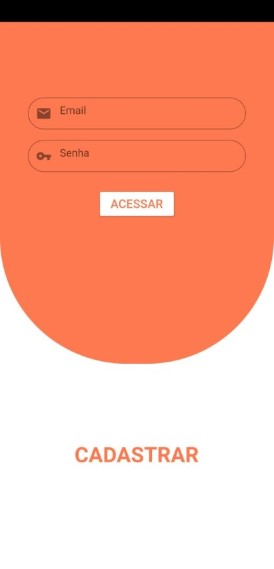
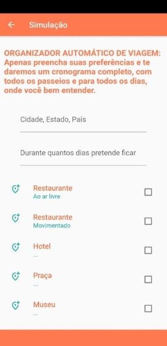
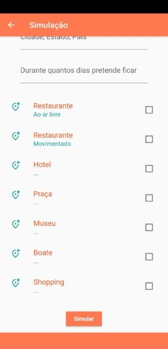
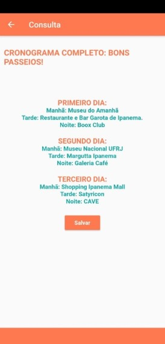
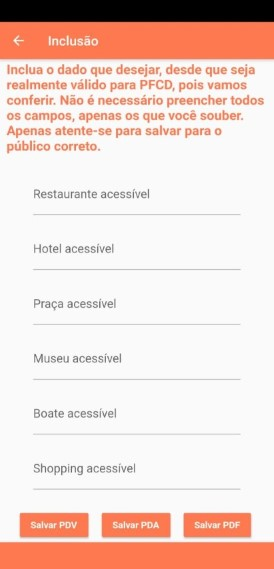

# Tourflix
## Seu destino em um click

### Missão ###
Nós temos como missão ajudar *turistas* a aproveitarem ao máximo sua experiência de viagem, fazendo os melhores passeios possíveis no seu tempo disponível, além de focarmos na inclusão de pessoas com diferentes deficiência, selecionando lugares que já tenham sido avaliados por outros turistas em relação a sua acessibilidade, em características como: rampas, elevador, textos em braile, intérprete de Libras, aceitação de cão guia e outros.
### Solução
Uma plataforma vinculada ao sistema *Smiles* em que os usuários conseguirão descobrir os melhores pontos turísticos da região, para aproveitar ao máximo o seu tempo de viagem. 
Para deixar a experiência mais personalizada, os usuários poderão selecionar suas preferências de locais, como: restaurante, parque, balada... E tempo de viagem, para montar seu próprio pacote.
Além disso, ele também poderá contribuir para viagens de pessoas com deficiência, informando sobre questões de acessibilidade nos locais que conhecer e ganhar milhas a cada informação compartilhada. 

### Visão
É direito de todos se divertir, ainda mais em lugares que contribuem com a acessibilidade, assim a médio prazo visamos alcançar o objetivo do Desenvolvimento Sustentável da Organização das Nações Unidas, na redução da desigualdade para pessoas com deficiência!

### Desenvolvimento
O desenvolvimento do app foi feito com *Flutter*, trata-se de um plataforma open source para programação para dispositivos móveis. 

### Vídeo Demo

### Vídeo Pitch

### Time

Nosso time é capacitado para desenvolver essa solução!

# tourflix_app

Aplicativo Smiles.

## Getting Started

This project is a starting point for a Flutter application.

A few resources to get you started if this is your first Flutter project:

- [Lab: Write your first Flutter app](https://flutter.dev/docs/get-started/codelab)
- [Cookbook: Useful Flutter samples](https://flutter.dev/docs/cookbook)

For help getting started with Flutter, view our
[online documentation](https://flutter.dev/docs), which offers tutorials,
samples, guidance on mobile development, and a full API reference.

